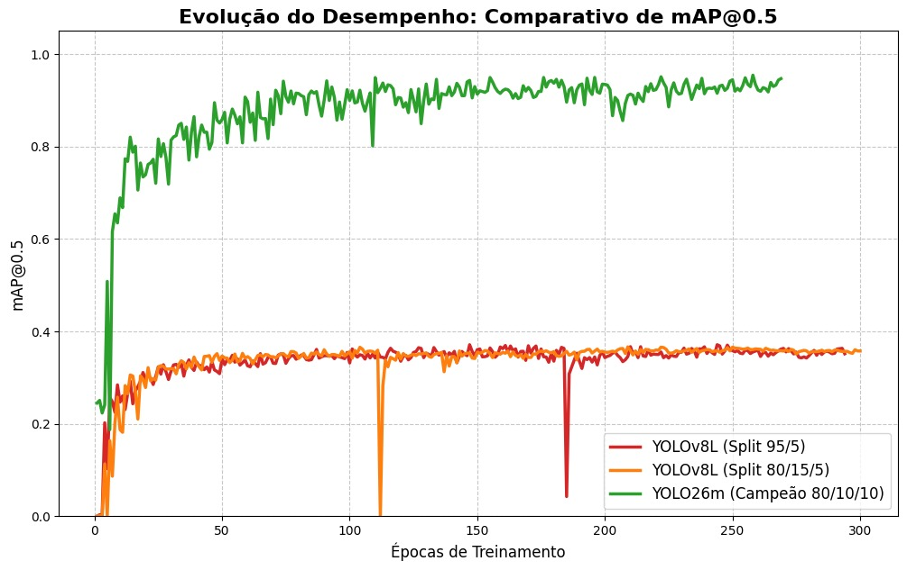
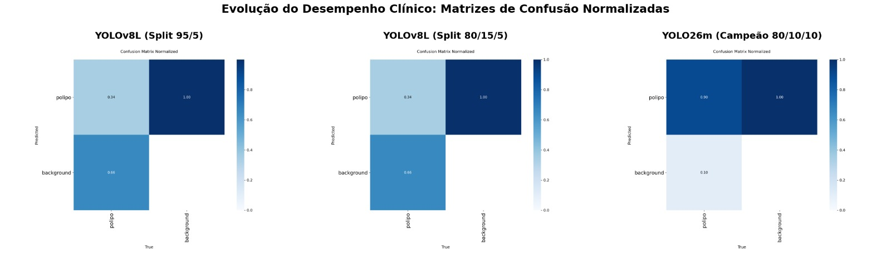
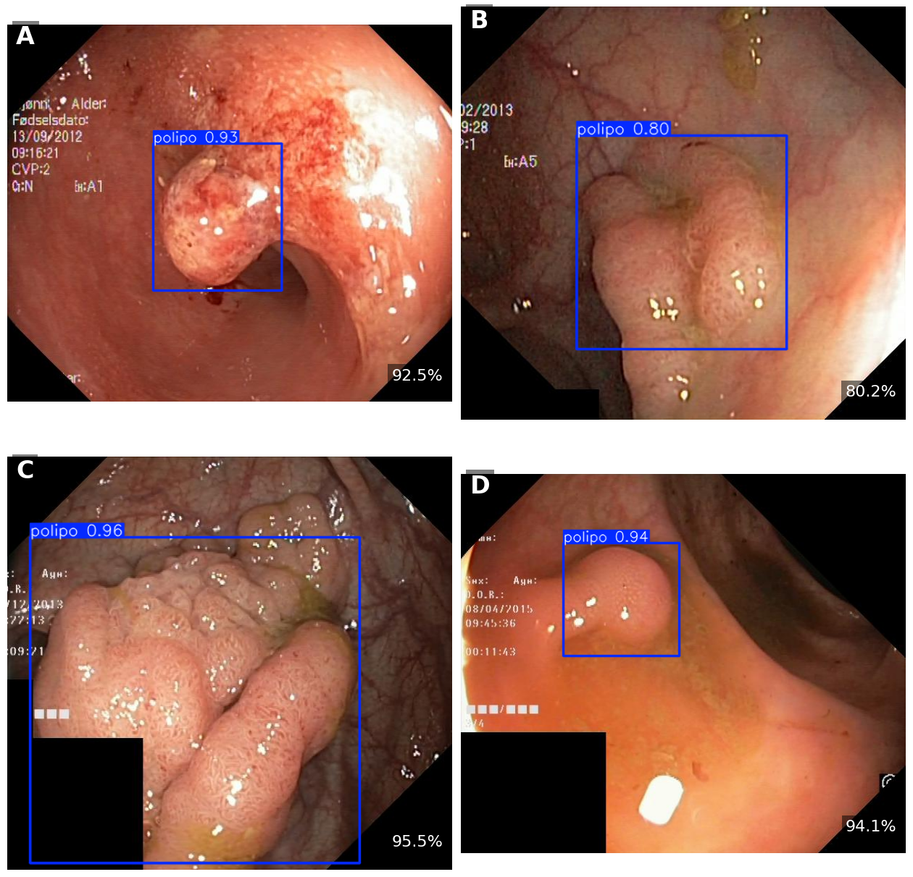

# 🔬 Detecção Automatizada de Pólipos Retais com YOLO26m

Este repositório contém os códigos, modelos e resultados do meu Trabalho de Conclusão de Curso (TCC) em Engenharia Elétrica, focado no desenvolvimento de um sistema de Diagnóstico Auxiliado por Computador (CADe) para a detecção de câncer colorretal.

## 🎯 Objetivo
Mitigar a taxa de falsos negativos na detecção de pólipos adenomatosos durante exames de colonoscopia, utilizando redes neurais convolucionais de estágio único (família YOLO) com inferência em tempo real.

## 🛠️ Metodologia
* **Dataset:** Kvasir-SEG (1.000 imagens).
* **Protocolo de Particionamento:** Foi aplicado um rigoroso particionamento cego de **80/10/10**.
* **Arquiteturas Avaliadas:** YOLOv8L (Baseline) vs. YOLO26m (Proposta).
* **Hardware:** Treinamento realizado em GPU NVIDIA Tesla T4.

## 📈 Resultados e Discussões
A evolução arquitetural resultou num salto clínico:
1. **Baseline YOLOv8L:** Estagnou em **36,6%** de mAP@0.5 (alto viés conservador).
2. **Modelo Proposto YOLO26m:** Rompeu a barreira, atingindo **94,6%** de mAP@0.5 e **88,6%** de recall.

### Comparativo de Desempenho (mAP@0.5)

### Matrizes de Confusão

### Exemplo de Inferência

## 🗂️ Reprodutibilidade e Dados Brutos
Para respeitar o limite de 100MB do GitHub (e evitar ficheiros de cache pesados `.pt`), os dados tabulares puros extraídos diretamente do treinamento (`results.csv` originais) foram incluídos na pasta `dados_treinamento`. Estes validam as curvas de aprendizado exibidas nos gráficos acima.

## 👨‍💻 Autor
* **Gabriel Alberto** - Graduando em Engenharia Elétrica (UniFOA)
* **Vitor Amadeu** - Professor em Engenharia Elétrica (UniFOA)
